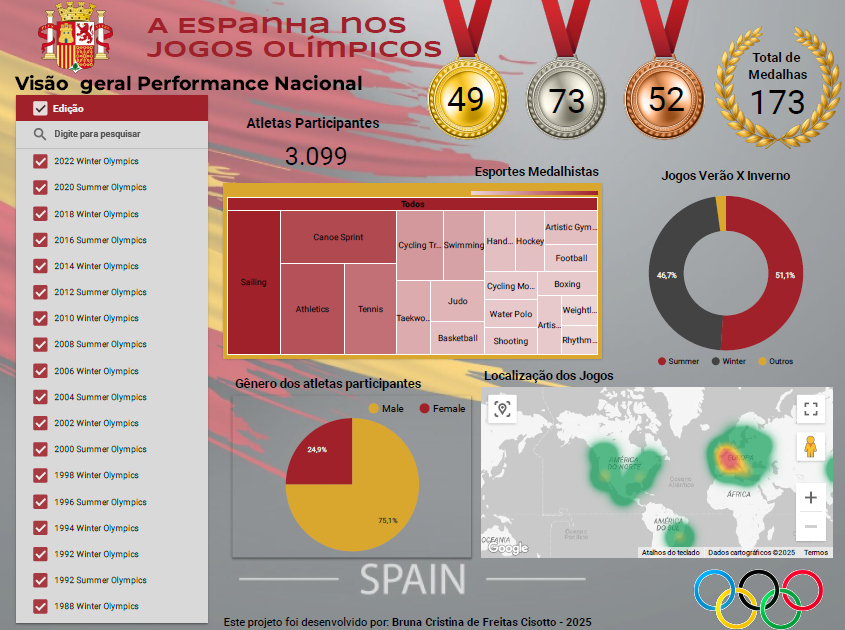

# Desafio 1 - Nivelamento

O desafio proposto nessa primeira fase da Residência, denominada nivelamento, era escolher um país e fazer uma análise do desempenho do mesmo nos jogos Olímpicos, na ferramenta Looker Studio.

Os datasets disponiveis para essa analise se encontram na pasta fontes de dados, que pode ser encontrada aqui.

## O que foi proposto 

Criar um dashboard interativo no Looker Studio que consolide e visualize a performance histórica completa de um único país nos Jogos Olímpicos (1896-2022), permitindo análise temporal, por modalidade esportiva e características dos atletas.

O documento com todos os requisitos que deveriam ser cumpridos se encontra aqui:

## Minha Análise 

Escolhi a Espanha como país a ser analizado, amo a cultura, comida, estilo de vida e as cidades espanholas e por isso decidi por esse país. 
Dividi meu Dashboard em 3 paginas sendo a primeira para uma visão geral, a segunda uma análise temporal e por modalidades e a terceira com foco no perfil dos atletas.

### Visão Geral 

Aqui inclui cards com o número de medalhas de cada tipo (ouro, prata e bronze), medalhas totais, quantidade de atletas. Aqui tive um problema a ser resolvido com relação a quantidade de medalhas, a Espanha algumas vezes ganhou medalhas em jogos coletivos e isso nos datasets era contado com uma medalha para cada jogador, o que gerava distorção nos números, por isso precisei trabalhar com campos calculados que contavam apenas uma vez a medalha, utilizando para isso o result_id do evento. 
Também inseri um gráfico de donut onde podemos ver a participação do país em jogos de verão X inverno e outros (que são versões equestres). Esse gráfico serve como filtro, se clicarmos somente em algum tipo de jogos toda a página será recalculada para mostrar apenas os números desse tipo.
Podemos também filtrar por edição, escolhendo o ano, e assim veremos na página toda apenas os números do ano escolhido. 
Temos um gráfico de árvore que nos indica em que modalidades o país teve mais relevancia em termos de número de medalhas, um gráfico de pizza que mostra o genero dos atletas e por fim um mapa de calor que nos mostra a localização dos jogos.
Algo que gostaria de ressaltar aqui é que todos os gráficos dessa página servem também como filtros para os demais, ou seja ao clicar em cada um deles toda a página será filtrada e recalculada.
Aqui está a imagem de como ficou a primeira página.

#### Insights 

Alguns insights que pude tirar nesse primeiro momento foram que:
- A Espanha se destaca muito em jogos de verão, seu desempenho em jogos de inverno é bem discreto, e levando poucos atletas, tendo em toda a história obtido apenas 5 medalhas nesse tipo de jogos, talvez isso se deva a ser um país quente.
- A quantidade de atletas mulheres, que representaram a Espanha em jogos Olímpicos é bem inferior a de homens.

### Temporal e por modalidade
Nessa página inclui a contagem de medalhas por ano dos jogos, a quantidade de medalhas por esporte e o genero dos atletas por edição, tudo isso pode ser filtrado através dos filtros posicionados acima da página (tipo de medalha e esporte), e em cada gráfico ao clicar em algum ponto ou barra especifico.

#### Insights 

Alguns insights que pude aqui:
- A Espanha tem grande destaque em esportes aquaticos como canoagem e vela, seria porque é um país muito banhado pelo mar?
- As Olimpiadas de 1992 foram as melhores para o país, coincidencia ou não nesse ano os jogos foram em Barcelona, ter a torçida ao lado fez muita diferença.
- A Espanha só passou a enviar mulheres de forma continua para os jogos em 1960, do ponto de vista histórico foi ontem, anterioremente em 1920 e 1924 havia mandado apenas 2 e 4 mulheres respectivamente, nas últimas olimpiadas o numero de competidores homens e mulheres quase se iguala.

### Perfil dos atletas
Aqui inclui um gráfico de barras com a distribuição de idade dos atletas medalhistas, uma tabela dinâmica com os nomes de cada medalhista, seus esportes e respectivas medalhas por tipo além de uma soma total, e um gráfico de dispersão onde podemos ver a média de peso e altura dos atletas por esporte. 
No topo podemos encontrar filtros por esporte, ano da ediçaõ e sexo dos atletas que vão alterar a visão geral dessa página.
Todos os gráficos aqui filtram os demais na página, a tabela de atletas, por exemplo, ao ter selecionado o nome de um atleta, mostrará nos demais gráficos a média de idade onde ele se encaixa e as médias de peso e altura da sua modalidade no gráfico de dispersão. 
O ideal da visualização do gráfico de dispersão é no próprio Looker Studio, aqui estamos com um print que deixa os nomes das modalidades um pouco confusos, mas na ferramenta ao passar o mouse fica bem claro cada esporte e suas métricas.

#### Insights 

Alguns insights interessantes:
- Não é novidade para ninguém, mas ver a diferença de média de altura e peso por modalidades é muito interessante, enquanto volei e basquete estão em um extremo as ginásticas estão em outro.
- A faixa dos 20 até os 30 anos é onde mais vemos medalhistas, seria essa a fase em que já houve tempo suficiente para treinar bastante e o corpo ainda está em forma?

