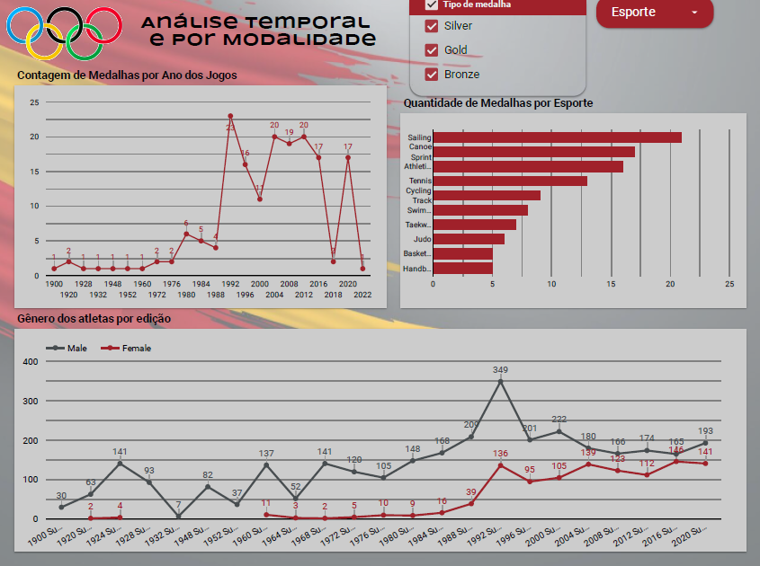
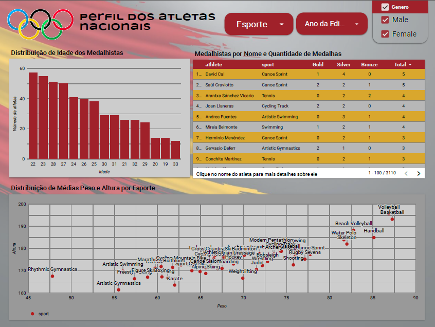

# Desafio 1 - Nivelamento

O desafio proposto nesta primeira fase da Residência, chamada **nivelamento**, consistiu em escolher um país e analisar seu desempenho nos Jogos Olímpicos utilizando o **Looker Studio**.

Os datasets disponíveis para essa análise estão na pasta **Fontes de Dados**, que pode ser acessada [aqui](../Desafio1/Fontes%20de%20dados).  

---

## O que foi proposto

O objetivo era criar um **dashboard interativo** no Looker Studio que consolidasse e visualizasse a performance histórica completa de um único país nos Jogos Olímpicos (1896-2022), permitindo:

- Análise temporal  
- Análise por modalidade esportiva  
- Características dos atletas  

O documento com todos os requisitos está disponível [aqui](../Desafio1/Fontes%20de%20dados/DesafioNivelamento.pdf).  

---

## Minha Análise

Escolhi a **Espanha** como país a ser analisado. Sou apaixonada pela cultura, comida, estilo de vida e cidades espanholas, então foi uma escolha natural.  

Dividi meu dashboard em **3 páginas**:  

1. **Visão Geral**  
2. **Análise Temporal e por Modalidade**  
3. **Perfil dos Atletas**  

---

### 1. Visão Geral

Nesta página incluí:

- **Cards**: número de medalhas por tipo (ouro, prata, bronze), total de medalhas e quantidade de atletas.  
  - Para corrigir a contagem de medalhas em esportes coletivos (onde cada jogador tinha seu registro), usei **campos calculados** que consideram apenas uma medalha por `result_id`.  
- **Gráfico Donut**: participação do país em Jogos de Verão, Inverno e outros (versões equestres).  
  - Este gráfico funciona como **filtro**, recalculando toda a página ao selecionar um tipo de jogo.  
- **Filtros por edição**: ao escolher o ano, todos os números da página se atualizam.  
- **Gráfico de Árvore**: modalidades em que a Espanha teve mais relevância em medalhas.  
- **Gráfico de Pizza**: gênero dos atletas.  
- **Mapa de Calor**: localização dos Jogos.  

Todos os gráficos funcionam como filtros para os demais da página, tornando a análise interativa.  

#### Insights

- A Espanha se destaca muito em **Jogos de Verão**; seu desempenho em Jogos de Inverno é discreto, com apenas 5 medalhas na história. Provavelmente, por ser um país quente.  
- A participação feminina nos Jogos Olímpicos é **bem menor** que a masculina, historicamente.

---

### 2. Temporal e por Modalidade

Nesta página, incluí:

- Contagem de **medalhas por ano** em um gráfico de Linha
- Quantidade de **medalhas por esporte**  em um gráfico de barras 
- Gênero dos atletas por edição em um gráfico com duas linhas, uma para mulheres e outra para homens. 

Filtros disponíveis: tipo de medalha, esporte e interações diretas com gráficos (clicando em pontos ou barras).  

#### Insights

- A Espanha tem destaque em esportes **aquáticos**, como canoagem e vela. Talvez influenciado por ser um país costeiro.  
- **1992** foi o melhor ano para a Espanha, coincidentemente quando os Jogos ocorreram em **Barcelona**. A torcida local fez diferença!  
- A participação feminina contínua começou apenas em **1960**. Antes, em 1920 e 1924, apenas algumas atletas participaram (2 e 4 respectivamente). Atualmente, o número de homens e mulheres está quase equilibrado.

---

### 3. Perfil dos Atletas

Incluí:

- **Gráfico de barras**: distribuição de idade dos medalhistas  
- **Tabela dinâmica**: nomes dos medalhistas, seus esportes, medalhas por tipo e total  
- **Gráfico de dispersão**: média de peso e altura dos atletas por esporte  

Filtros no topo: esporte, ano da edição e sexo dos atletas.  

Todos os gráficos interagem entre si. Por exemplo, ao selecionar um atleta na tabela, os demais gráficos atualizam mostrando médias relacionadas à sua modalidade.  

> Observação: no print do gráfico de dispersão os nomes dos esportes ficam um pouco confusos, mas no Looker Studio ao passar o mouse cada esporte e suas métricas ficam claros.

#### Insights

- Diferenças de **altura e peso** por modalidade são perceptíveis: vôlei e basquete em um extremo, ginástica em outro.  
- A faixa etária mais comum entre medalhistas é **20 a 30 anos**, sugerindo que é o período ideal de maturidade física e experiência.

O dashboard completo ficou assim: 

%20(1).pdf)

---
## Conclusão

Essa primeira experiência no Looker Studio foi intensa, aprender a utilizar a ferramenta na prática foi desafiador, mas ver as interações dos gráficos funcionando, os números batendo e a análise tomando forma me encheu de alegria e satisfação.
Ao utilizar o Looker para a visualização desse dashboard tenha paciência, ele demora para carregar, meu próximo desafio pessoal é descobrir como torna-lo mais leve.
Estou ansiosa para as próximas etapas dessa Residência.

[Acesse o dashboard no Looker Studio](https://lookerstudio.google.com/reporting/df2145c6-2123-44a7-8678-023a3caa10e5)

